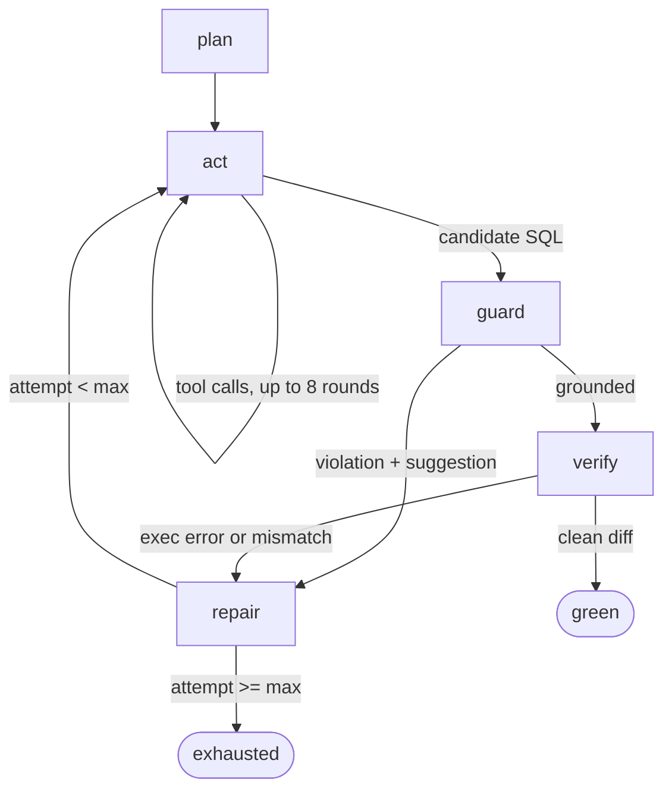

# sqlAgentGo

A SQL dialect conversion agent that translates T-SQL and Oracle PL/SQL SELECT statements into
Snowflake-flavored SQL and **verifies the translation by differential execution** — the source
query and the translated query are run against two engines loaded with identical fixtures, and
the result sets are diffed.

Dialect migration is manual and error-prone: a human reviewer cannot reliably tell whether a
rewritten query returns the same rows by eyeballing it, and the classic failure modes (argument
order in `DATEADD`, Oracle implicit casts, `ROWNUM` applied before `ORDER BY`, NULL semantics)
are exactly the ones that slip through code review. This project makes correctness a measurement:
an LLM proposes the translation, a schema-groundedness guard rejects hallucinations cheaply, and
only a clean differential diff counts as a pass.

## Architecture

```
                 ┌────────────┐
                 │   plan     │  LLM: structured translation plan (JSON)
                 └─────┬──────┘
                       ▼
                 ┌────────────┐   ┌──────────────────────────┐
        ┌───────►│    act     │──►│ tools (function calling) │
        │        └─────┬──────┘   │ schema_lookup            │
        │              │          │ dialect_ref              │
        │              ▼          │ dry_run (EXPLAIN)        │
        │        ┌────────────┐   │ execute_and_diff         │
        │        │   guard    │   └──────────────────────────┘
        │        └─────┬──────┘
        │              │ grounded            violation (never executes)
        │              ▼                        │
        │        ┌────────────┐                 │
        │        │   verify   │  execute + diff │
        │        └─────┬──────┘                 │
        │        clean│  │error/mismatch        │
        │             ▼  │                      │
        │        ┌────────────┐ ◄───────────────┘
        │        │   green    │
        │        └────────────┘
        │
        └── repair: feed prior candidate + exact failure (or first 5 diff
            mismatches) back to act, bounded by max attempts
```



Every run is persisted as JSONL under `traces/<case-id>/<timestamp>.jsonl` — one record per node
with latency, token counts, tool calls with arguments, and the candidate SQL at that point.

## Scoreboard

Real run: 35 corpus cases × {agentic loop, naive baseline}, `llama3.2:3b` via local Ollama,
4 max attempts, concurrency 4 (see `results.json` / `report.md`).

| group | agent pass% | baseline pass% | agent Δ |
| --- | --- | --- | --- |
| overall | 62.9% (22/35) | 40.0% (14/35) | +22.9 pts |
| dialect: oracle | 35.3% (6/17) | 29.4% (5/17) | +5.9 pts |
| dialect: tsql | 88.9% (16/18) | 50.0% (9/18) | +38.9 pts |
| difficulty: easy | 45.5% (5/11) | 36.4% (4/11) | +9.1 pts |
| difficulty: hard | 72.7% (8/11) | 45.5% (5/11) | +27.3 pts |
| difficulty: medium | 69.2% (9/13) | 38.5% (5/13) | +30.8 pts |
| tag: cte | 100.0% (3/3) | 33.3% (1/3) | +66.7 pts |
| tag: date_fn | 42.9% (3/7) | 14.3% (1/7) | +28.6 pts |
| tag: implicit_cast | 100.0% (3/3) | 33.3% (1/3) | +66.7 pts |
| tag: join | 75.0% (6/8) | 50.0% (4/8) | +25.0 pts |
| tag: null_fn | 25.0% (1/4) | 0.0% (0/4) | +25.0 pts |
| tag: rownum | 33.3% (1/3) | 100.0% (3/3) | -66.7 pts |
| tag: string_fn | 50.0% (2/4) | 25.0% (1/4) | +25.0 pts |
| tag: top_n | 66.7% (2/3) | 100.0% (3/3) | -33.3 pts |
| tag: window | 83.3% (5/6) | 66.7% (4/6) | +16.7 pts |

Other agent-mode numbers from the same run: mean 1.55 attempts to green (p90 2.0), mean 8,886
prompt / 525 completion tokens per conversion, guard caught a hallucination before execution in
5.7% of runs (failures: 13 `exec_error`).

Honest read: on a 3B local model the loop converts roughly 1.5× as many cases as a single naive
prompt, and the gain concentrates exactly where repair matters — hard cases (+27.3 pts) and
tool-hungry constructs like CTEs and implicit casts — while it loses only on `rownum`/`top_n`,
where this weak model already passes trivially. A 3B model's repair replies are noisy; the
headline number is the measurement harness working as intended, not a claim about frontier models.

## Verification targets

Pass/fail comes only from the differential execution oracle, and the oracle has two target engines:

- **DuckDB (default, zero-credential)** — an embedded instance seeded from `db/seed_duckdb.sql`.
  This is what local dev, tests, and the committed evaluation use; no account needed.
- **Snowflake (fidelity path)** — `internal/exec/snowflake.go`, behind `//go:build snowflake`
  (gosnowflake). When the binary is built with `-tags snowflake` and `SNOWFLAKE_ACCOUNT` is set,
  `sqlagent eval` and `sqlagent serve` substitute Snowflake as the verification target instead of
  DuckDB. Provision the target with `db/seed_snowflake.sql` (same deterministic fixtures), then:

  ```sh
  go build -tags snowflake ./...
  SNOWFLAKE_ACCOUNT=xy12345 SNOWFLAKE_USER=... SNOWFLAKE_PASSWORD=... \
    go run -tags snowflake ./cmd/sqlagent eval --corpus testdata/corpus
  ```

  DuckDB is fast, free, and identical to the Postgres fixtures; Snowflake is the only place the
  candidate actually runs on its intended engine, so it is the higher-fidelity check.

## Serving and operations

```sh
docker compose --profile full up   # server + postgres + prometheus + grafana
curl -s localhost:8080/healthz
curl -s -X POST localhost:8080/v1/convert -H 'Content-Type: application/json' \
  -d '{"source_sql":"SELECT o_orderkey FROM orders ORDER BY o_totalprice DESC LIMIT 10","source_dialect":"tsql"}'
curl -s localhost:8080/v1/traces/<trace_id>   # JSONL trace (returned in the response)
curl -s localhost:8080/metrics                # Prometheus metrics
# Grafana: http://localhost:3000 (anonymous admin) -> "sqlagent conversions" dashboard
```

The server logs one structured JSON line per request (`trace_id` included), honors request
cancellation and a per-request timeout (`--timeout`, default 5m), and exposes
`conversion_attempts`, `conversions_total{status}`, `guard_violations_total{kind}`,
`llm_tokens_total{type}`, and `llm_request_duration_seconds` (Prometheus at :9090 scrapes it).

Container images (multi-stage `Dockerfile`):

- `sqlagent` (default): full server with the embedded DuckDB target, on distroless/cc.
  DuckDB is statically linked, so the image is ~120MB — the engine is the size.
- `sqlagent-minimal`: static, CGO-free, no DuckDB, on distroless/static, **15MB**. Pair it with
  the Snowflake target (`--build-arg TAGS=snowflake`).

## Quickstart

```sh
make up                # postgres:16 on 5435 with TPCH-lite fixtures
make seed              # load db/seed.sql (Postgres) + db/seed_duckdb.sql (embedded DuckDB)
export OPENAI_API_KEY=sk-...       # or point at any OpenAI-compatible endpoint:
export LLM_BASE_URL=http://localhost:11434/v1
export LLM_MODEL=llama3.2:3b

echo 'SELECT TOP 10 o_orderkey FROM orders ORDER BY o_totalprice DESC' \
  | go run ./cmd/sqlagent convert --dialect tsql
# prints the Snowflake SQL, then: attempts=N status=green trace=traces/...

go run ./cmd/sqlagent eval --corpus testdata/corpus --compare   # writes results.json
make report                                                     # renders report.md
```

## How correctness is defined

Pass/fail comes **only** from the differential execution oracle:

1. The source query runs on the source engine (Postgres, seeded from `db/seed.sql`).
2. The candidate translation runs on the target engine (embedded DuckDB, seeded from
   `db/seed_duckdb.sql` — the Snowflake stand-in).
3. `ResultSet.Diff` compares them order-insensitively: rows are sorted by a canonical key,
   floats use a 1e-9 epsilon, NULLs are distinct from the empty string, and the first 20
   mismatches are reported.

`expected_target_sql` in the corpus is used only for similarity reporting and never for
pass/fail. The guard runs before execution and rejects candidates that reference identifiers
absent from the introspected schema — the cheap failure path that skips engine round-trips.

Limits of the oracle, stated plainly:

- **Fixture data coverage**: the TPCH-lite seed has ~200 rows per table and 5/25 rows for
  region/nation. A translation that is wrong only on data the fixtures never contain (sparse
  NULLs, wide type ranges, boundary dates) will pass.
- **Non-determinism**: queries using `CURRENT_DATE`/`CURRENT_TIMESTAMP` are avoided in the
  corpus; models are sampled at temperature 0, but no local model is bit-reproducible.
- **Unsupported constructs**: candidates must parse under the Postgres grammar used by the
  guard (`auxten/postgresql-parser`) and execute on DuckDB; Snowflake-only syntax such as
  `QUALIFY` therefore fails closed today.
- **Semantic equivalence ≠ textual equivalence**: the oracle checks result-set equality on the
  fixtures, not logical equivalence of the two queries.

## Design decisions

- **Why Go, not a Python sidecar**: the state machine, parser, two embedded/first-class DB
  drivers, and the diff engine all live in one typed binary — no orchestration glue, and the
  whole loop (except the LLM itself) runs offline with zero external services.
- **Why typed tools instead of free-form generation**: each tool is a Go struct with a fixed
  JSON schema (OpenAI function-calling format); the registry dispatches by name, so tool calls
  are introspectable, unit-testable in isolation, and logged with exact arguments in traces.
- **Why the guard runs before execution**: identifier checks are microseconds and parse trees
  are free; engine round-trips and repair cycles are seconds and tokens. Rejecting a
  hallucinated column before `verify` keeps the failure cheap and the repair feedback precise.
- **Why attempts are bounded**: an LLM left to self-correct loops can burn tokens without
  converging. Four attempts (configurable) makes cost and latency predictable, and turns
  non-convergence into a measurable failure class (`exhausted`) instead of a hang.
- **Why two seed files**: DuckDB needs `//` integer division, `AS g(i)` table-function aliases,
  and `INTERVAL n DAY` where Postgres uses `/`, `AS i`, and `date + int`; keeping a
  compatibility shim instead of one lowest-common-denominator seed preserves realistic
  Postgres-style fixtures for the source engine.
- **Why T-SQL/Oracle sources are Postgres-valid in the corpus**: the oracle executes the source
  on Postgres, so corpus cases present dialect intent in its closest executable form and the
  traps (DATEDIFF order, ROWNUM-before-ORDER-BY, implicit casts) bite the *translation*, which
  is what we measure.

## Layout

```
cmd/sqlagent/        CLI: convert, eval (corpus harness), serve, hidden seed/tools
internal/agent/      plan → act → guard → verify → repair state machine + baseline mode
internal/guard/      schema-groundedness checker (AST walk, alias/CTE resolution)
internal/llm/        OpenAI-compatible /v1/chat/completions client
internal/tools/      schema_lookup, dialect_ref, dry_run, execute_and_diff + registry
internal/exec/       Postgres + DuckDB executors, ResultSet.Diff
internal/schema/     information_schema introspection
internal/corpus/     YAML case loader
internal/harness/    scoreboards, failure classes, USD/pricing, markdown reports
db/                  TPCH-lite seeds (Postgres + DuckDB shim)
testdata/corpus/     35 conversion cases
scripts/             make_report.go, check_coverage.go
```

## Tests

```sh
make test                                # unit + smoke tests (needs `make up`)
go test ./internal/... -coverprofile=coverage.out
go run scripts/check_coverage.go coverage.out 75
go test ./internal/guard -fuzz FuzzCheckClosed -fuzztime 30s   # native fuzzing
go test -tags integration ./internal/agent -run TestIntegrationLiveLLM -v  # live LLM, skips without key
```


